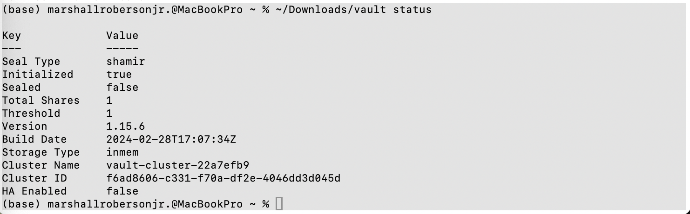
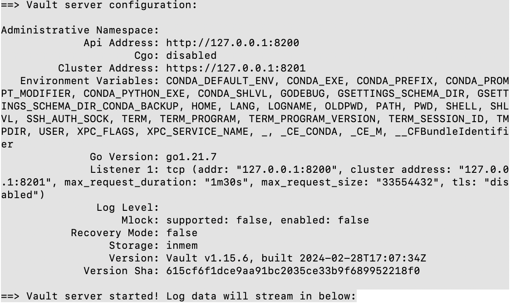
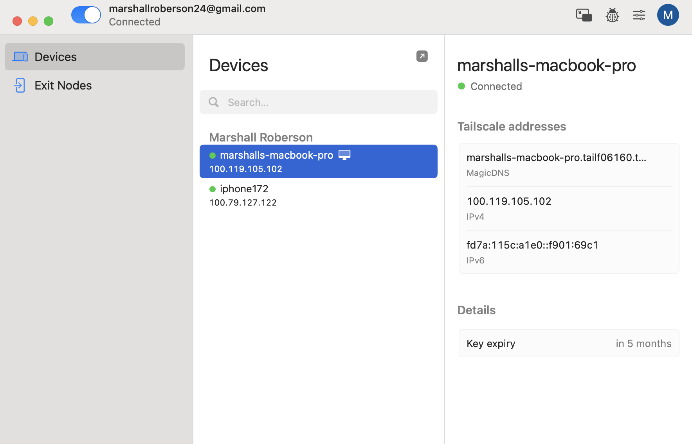
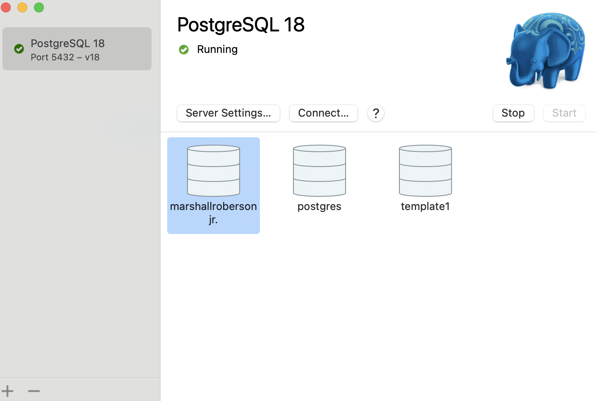

# PAM + Zero Trust Access Lab

A hands-on identity security project demonstrating privileged access management (PAM) and Zero Trust network access principles using HashiCorp Vault, PostgresApp, and Tailscale.

## Overview
This project simulates enterprise security challenges by eliminating standing privileged access and implicit network trust through native application layers.

## Architecture
- **Privileged Access Management (Vault + PostgreSQL):** Issues short-lived, auto-expiring database credentials via HashiCorp Vault and PostgresApp.
- **Just-in-Time & Policy Access:** Enforces read-only capability mapping with automated TTL expiration.
- **Zero Trust Network (Tailscale):** Implements WireGuard-based mesh overlay with strict endpoint authentication and identity-driven access controls (`autogroup:member`).

### Infrastructure Status Validation

### Environment Startup Details

### Tailscale Secure Mesh Verification

### Native PostgreSQL Backend Verification

## Threat Model Mitigation Matrix
- **Credential Theft:** Mitigated via dynamic, short-lived tokens.
- **Lateral Session Movement:** Mitigated via Tailscale zero-trust segmentation policies.
- **Standing Administrative Privileges:** Controlled through 1-hour TTL expiration windows.

## Tech Stack
- HashiCorp Vault, PostgreSQL Engine (PostgresApp), Tailscale, Zsh UNIX Environment.

